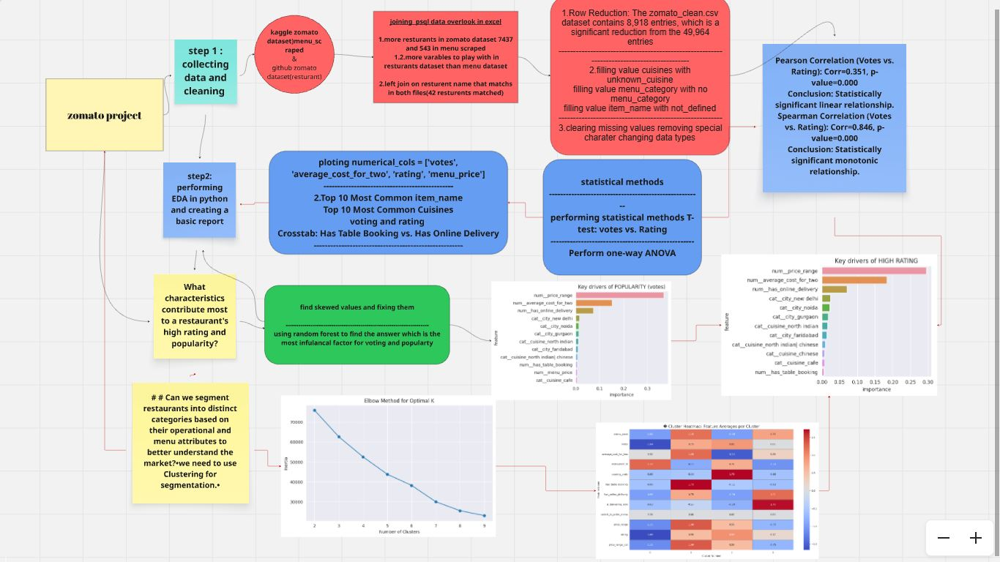

# Zomato-Restaurant-Analysis

This project aimed to analyze restaurant data from the Zomato dataset to uncover key insights about what drives high ratings and popularity among restaurants. The analysis involved multiple stages, including data collection, cleaning, exploratory data analysis (EDA), statistical testing, and machine learning techniques.

---
# sql oprations perfomred 

 left joint two tables on resturant name as pramary key

---
# Data Cleaning & Preprocessing:

 Handled duplicate entries based on restaurant addresses, identified and filled missing values in key columns such as cuisines, menu_category, item_name, and menu_price

---
# Exploratory Data Analysis (EDA):

Analyzed the distribution of top cuisines offered by restaurants.

Identified and visualized top-rated restaurants.

Explored restaurant distribution across different cities.

Investigated the average cost for two people in various cities.

Examined the prevalence of online delivery services and table booking options.

Analyzed the patterns in restaurant ratings and the number of votes received.

Visualized restaurant density on a world map to identify geographical trends.

Explored popular menu categories and individual food items.

Top 10 Most Common Cuisines

Has Table Booking vs. Has Online Delivery

bivariate analysis cat vs cat | cat vs num | num vs num

---

# performing statistical methods and ML Methods  :
 
T-test: Online Delivery vs. Rating

Perform one-way ANOVA

## **find skewed values and prep data for RandomForestRegressor
**

---

## **using RandomForestRegressor to find the answer which is the most infulancal factor for voting and popularty  
**

---
## **Can we segment restaurants into distinct categories based on their operational and menu attributes to better understand the market?•we need to use Clustering for segmentation**
**

---

# a simple easy to understand presentation using power-BI

